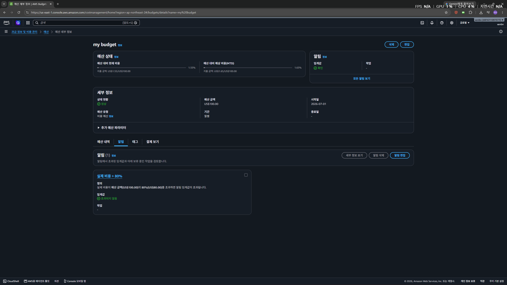

# 클라우드 아키텍처 설계 및 배포

## 목차

1. 프로젝트 소개
2. 주요 기능
3. 기술 스택
4. 리팩토링
5. 트러블슈팅

## 프로젝트 소개

해당 프로젝트는 AWS를 통해 serverless 환경을 구성하여 작성한 프로그램을 배포하고 CI/CD 파이프라인을 구성함으로써, 클라우드 아키텍쳐 설계를 이해하고 AWS를 이용한 백엔드 설계의 이해도를 높이는 것을 목표로 한다.

## 주요 기능

### 기능 추가

---

## 기술 스택

### 언어
JAVA 17

### 프레임워크
Spring Boot 4.1.0

### 빌드 도구
Gradle (Groovy)

### Version Control
Git / GitHub

### DBMS
H2 (LOCAL)
MYSQL (AWS RDS)

---

## LV. 0 - AWS BUDGETS 설정

---

## LV. 1 - EC2 public ip 

3.39.253.248

## LV. 2

1. actuator info url: http://3.39.253.248:8080/actuator/info

2. RDS security group
    

## 트러블슈팅

### 문제 사항 기술

- **문제**:
- **원인**: 
- **해결**: 
