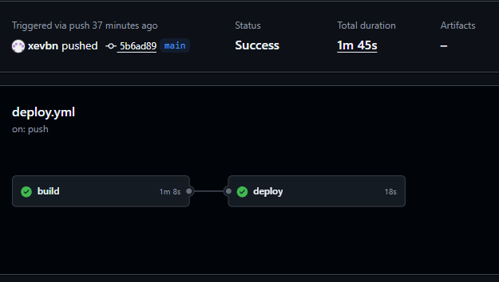
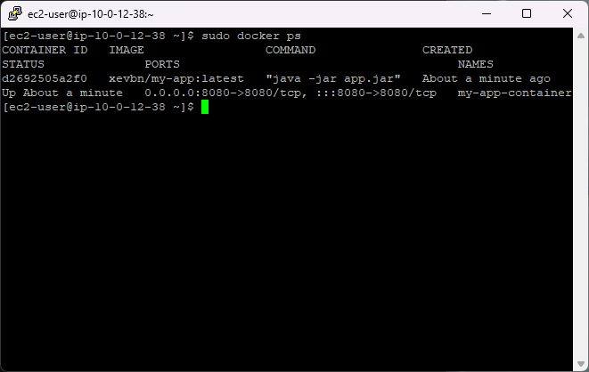

# 클라우드 아키텍처 설계 및 배포

## 목차

1. 프로젝트 소개
2. 주요 기능
3. 기술 스택
4. 리팩토링
5. 트러블슈팅

## 프로젝트 소개

해당 프로젝트는 AWS를 통해 serverless 환경을 구성하여 작성한 프로그램을 배포하고 CI/CD 파이프라인을 구성함으로써, 클라우드 아키텍쳐 설계를 이해하고 AWS를 이용한 백엔드 설계의 이해도를 높이는 것을 목표로 한다.

## 주요 기능

### 기능 추가

---

## 기술 스택

### 언어
JAVA 17

### 프레임워크
Spring Boot 4.1.0

### 빌드 도구
Gradle (Groovy)

### Version Control
Git / GitHub

### DBMS
H2 (LOCAL)
MYSQL (AWS RDS)

---

## LV. 0 - AWS BUDGETS 설정

---

## LV. 1 - EC2 public ip 

3.39.253.248

## LV. 2

1. actuator info url: http://3.39.253.248:8080/actuator/info

2. RDS security group
    

## LV. 3 - Presigned URL

## LV. 4

1. CI/CD 성공

2. Docker 실행 화면

## LV. 5

1. URL: https://api.xevbn.click/actuator/health
2. Target Group Image

## LV. 6

## 트러블슈팅

### 문제 사항 기술

- **문제**:
- **원인**: 
- **해결**: 

memo

ci/cd 테스트 중에 빌드 문제 발생
1. S3 관련 자동 구성에서 발생
    - test 환경 구성을 만들어 해결 시도: 실패
    - AwsProfileApplicationTests 클래스에서 @EnableAutoConfiguration(exclude={S3AutoConfiguration.class})로 S3 자동 구성 제외: 해결
2. OIDC 문제
    - OIDC 발급 및 역할 추가 및 설정
    - ec2 IAM ROLE에 SSM 설정이 없었음
    - AmazonSSMManagedInstanceCore 정책 추가 및 github actions의 oidc에 부여한 역할에 정책 추가
3. Docker 이미지 빌드 문제
    - Docker에 설정을 하지 않을 시 호스트 머신의 아키텍처를 그대로 따라감
    - AWS EC2는 ARM64 아키텍처, 호스트는 AMD64 아키텍처로 상이함
    - 빌드 옵션에 ARM64, AMD64 아키텍처 전부 가능하도록 설정
4. 배포 과정에서 명령어 결과 확인 불가
   - CD에 명령어 추가
5. ASG에서 지속적인 health check fail로 반복적인 scale in/out 발생
   - 인스턴스가 채 다 올라오기 전에 health check를 함으로써 health check fail
   - ASG 설정에 인스턴스 웜업 시간을 180->300으로 변경해 문제 해결